# 1.关于对象

## 现用C++对象模型

在c++中，有两种类数据成员：static 和 nonstatic；三种类函数成员：static、nonstatic、virtual。

函数都放到代码区，而static成员都放到静态区，因此

c++对象的大小由 nonstatic类数据成员、内存填充和virtual指针决定，其中virtual指针来源于：

virtual function：用以实现动态多态，支持一个有效率的 "执行期绑定"
virtual base class：用以解决多重继承中的内存问题
c++对象模型如下：

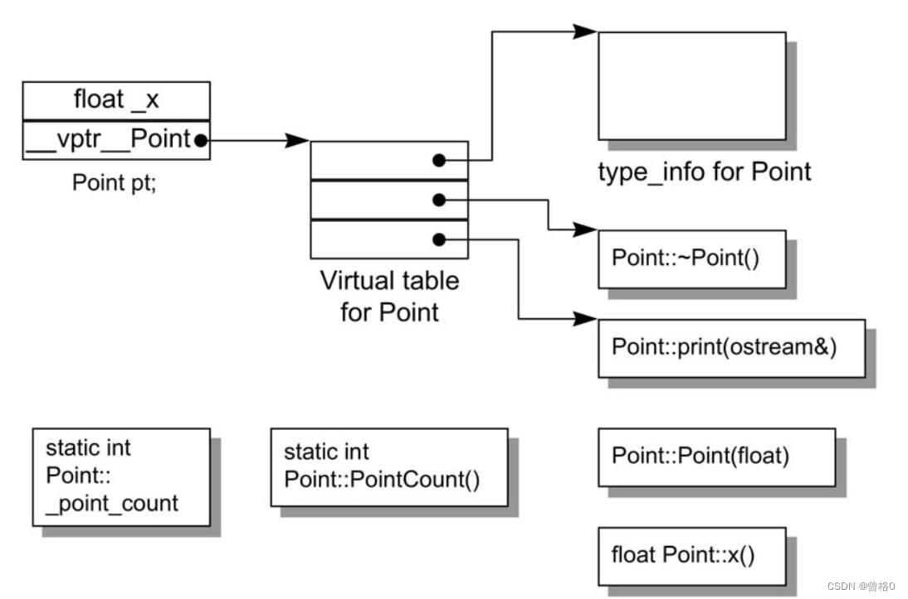

注意：

虚函数表的第一个slot并不是类虚函数地址，而是类的类型信息（用以支持RTTI）。
vptr的初始化由编译器在construct中初始化
vptr的放置顺序C++ standard并未做出规定，但一般放在对象的头部或者尾部（最常见的是放头部）；对象中的数据成员按照其申明顺序放置。
编译器程序转换
px->foo();  // 假如foo()是虚函数

// 编译器转换后

px->_vtbl[2];   // 虚函数表其实就是个指针数组
对象模型为：


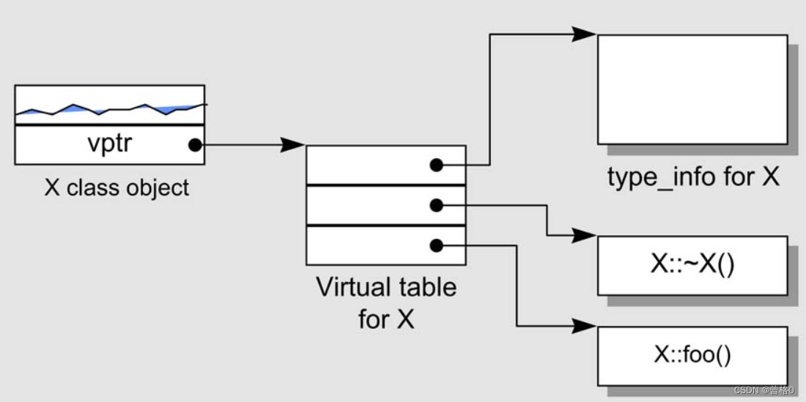

## 关键词差异

int ( *pq ) ( ); //声明

1.当语言无法区分那是一个声明还是一个表达式时，我们需要一个超越语言范围的规则，而该规则会将上述式子判断为一个“声明“

2.struct和class可以相互替换，他们只是默认的权限不一样

3.如果一个程序员需要拥有C声明的那种struct布局，可以抽出来单独成为struct声明，并且和C++部分组合起来

## 对象的差异

- C++程序设计模型直接支持三种程序设计范式（programming paradigms）

  - 程序模型（procedural model）

  - 抽象数据类型模型（abstract data type model，ADT）

    - 所谓的“抽象”是和一组表达式（public接口）一起定义

  - 面向对象模型（object-oriented model）

    - 此模型中有一些彼此相关的类型，通过一个抽象的base class（用以提供共同接口）被封装起来

    - 支持多态的场景

      - 1、经过一组隐式的转换操作，如把派生类指针转换成基类指针

      - 2、经由virtual function机制

      - 3、经由dynamic_cast和typeid运算符

        ```c++
        if(circle *pc = dynamic_cast<circle*>(ps)) ....
        
        ```

      - 多态的主要用途：仅有一个共同的接口来影响类型的封装，这个接口通常被定义在一个抽象的base class中。

    - class object 的大小

      - 1、其nonstatic data members的总和大小
      - 2、加上任何由于alignment的需求而填补（padding）上去的空间
        - alignment就是将数值调整到某数的倍数，在32位计算机上，通常alignment为4bytes(32位)，以使bus的“运输量”达到最高效率
      - 3、加上为了支持virtual而由内部产生的任何额外负担

## 指针类型

指针的类型，只能代表其让编译器如何解释其所指向的地址内容，和它本身类型无关，所以**转换其实是一种编译器指令，不改变所指向的地址，只影响怎么解释它给出的地址**

base class不管是pointer或reference的类型将在编译时期决定以下两点：

　　　固定的可用接口，也就是说，只能调用derived class的public的接口

　　　该接口的access level

当一个**基类对象**被初始化为一个**子类对象**时，派生类就会被切割用来塞入较小的基类内存中，派生类不会留下任何东西，多态也不会再呈现。

```c++
Bear b;
ZooAnimal *pz=&b;
Bear *pb=&b;
//都指向Bear object的第一个byte。差别是，静态化类型实例不同，一个覆盖整个Bear object，而PZ只覆盖基类部分。

pz->cell_block();//不合法，cell_block()是Bear 的特有普通函数
(static_cast<Bear*>(pz))->cell——block(); //可以
if(Bear *p2=dynamic_cast<Bear*>(pz))
    p2->cell_block(); //更好 但运行时转换成本高

pz->rotate(); //一个虚函数的调用
```

# 3.Data语义

```c++
class X{};
class Y : public virtual X {};
class Z : public virtual X {};
class A : public Y,public Z {};

sizeof(X)	//1   VC++ 1
sizeof(Y)	//8        4
sizeof(Z)	//8        4
sizeof(A)	//12       8
```

不同的对于empty virtual base class的处理导致不同的模型（不是空的虚基类时可能会是一样的模型）

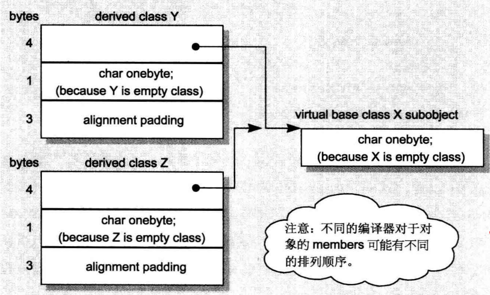

empty virtual base class 所占的 1 字节内存应该被优化掉（被视为派生类对象最开头的一部分）

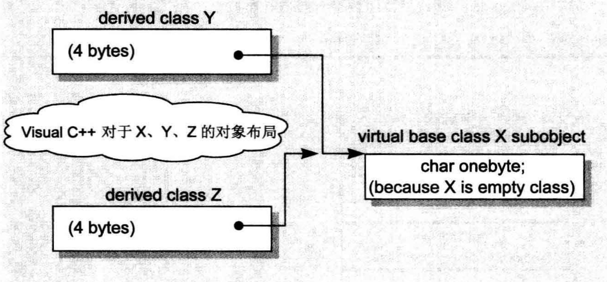

- X为1是因为编译器的处理，在其中插入了1个char，为了**让其对象能在内存中有自己独立的地址**
- Y，Z**是因为虚基类表的指针**
- **A 中含有Y和Z所以是8**
- A是12因：共享的一个class X的大小1，Base class Y的大小减去配置virtual base class X的大小，结果4，Z同理4，结果9 在加3=12.
- 每一个类对象大小的影响因素：
  - **非静态成员变量的大小**
  - **virtual特性**
  - **内存对齐**

## 3.1数据成员绑定

- **如果类的内部有typedef,请把它放在类的起始处，因为防止先看到的是全局的和这个typedef相同的冲突，编译器会选择全局的，因为先看到全局的**

## 3.2数据成员布局绑定

- **非静态成员变量的在内存中的顺序和其声明顺序是一致的**
- 但是**不一定是连续的**，因为中间可能有内存对齐的填补物
- virtual**机制的指针所放的位置和编译器有关**
- 类定义中pubic,private,protected的数量，不影响类对象的sizeof

一个可以判断哪个数据成员or访问领域先出现在类对象中的函数

```c++
template<class class_type,class data_type1, class data_type2>
char* access_order(data_type1 class_type::*mem1,data_type2 class_type::*mem2)
{
    assert(mem1!=mem2);
    return mem1<mem2?"member1 first ":"member2 first";
}

access_order(&Point3d::z,&Point3d::y);
```

## 3.3数据成员的存取

静态变量都被放在一个全局区，与类的大小无关，**正如对其取地址得到的是与类无关的数据类型，**如果两个类有相同的静态成员变量，编译器会暗自为其名称编码，使两个名称都不同
非静态成员变量则是直接放在对象内，经由对象的地址和在类中的偏移地址取得，但是在继承体系下，情况就会不一样，因为编译器无法确定此时的指针指的具体是父类对象还是子类对象

## 3.4继承下的数据成员

### 单一继承没有虚函数

布局：

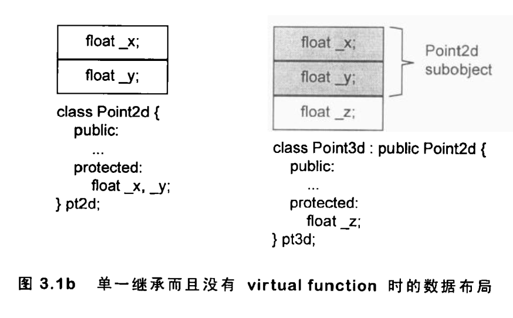

**这种情况下常见错误**：

- 可能会重复设计一些操作相同的**函数**，我们可以把某些函数写成**inline**,这样就可以在子类中**调用**父类的某些函数来**实现简化**
- **把数据放在同一个类中和继承起来的内存布局可能不同，因为每个类需要内存对齐**

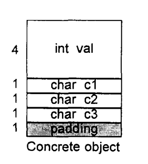

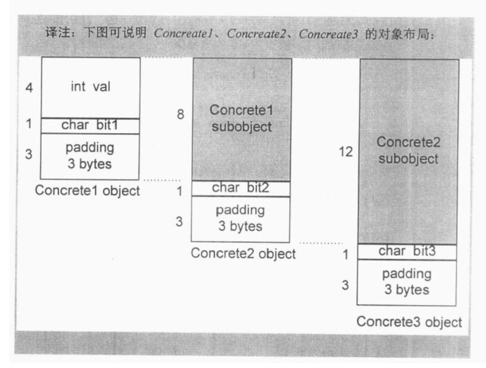

- **容易出现的不易发现的问题：**
- 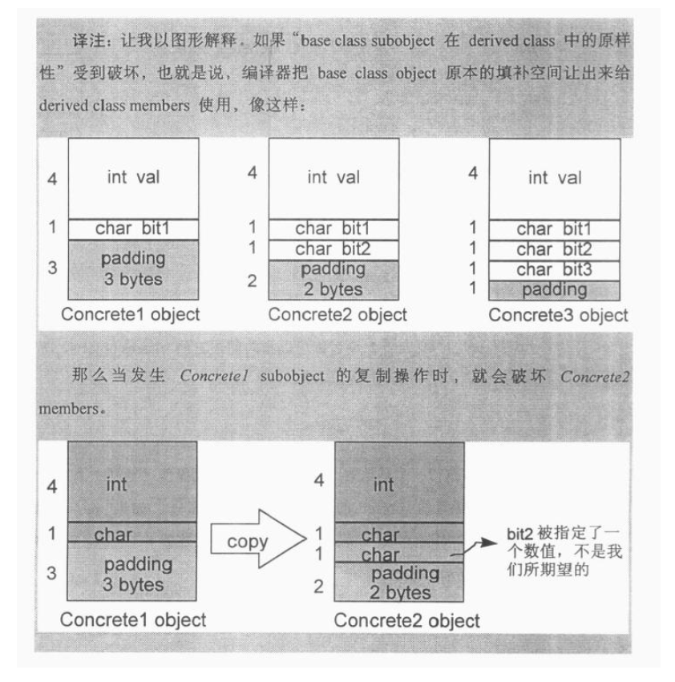

### 单一继承加上多态

导入一个虚函数表，表中的个数是声明的虚函数的个数加上一个或两个slots(用来支持运行类型识别)

在每个对象中加入vptr，提供执行期的链接，使每一个类能找到相应的虚函数表

加强构造函数，使它能够为vptr设定初值，让它指向对应的虚函数表，这可能意味着在派生类和每一个基类的构造函数中，重新设定vptr的值

加强析构函数，使它能够消抹“指向类的相关虚函数表”的vptr,vptr很可能以及在子类析构函数中被设定为子类的虚表地址。

析构函数的调用顺序是反向的，从子类到父类

不同的vptr位置，会导致继承体系中不同的布局：

放在class 的尾端；放在class的头端；例如放在base class的尾端

### 多重继承

- **单一继承特点：**派生类和父类对象都是从相同的地址开始，区别只是派生类比较大能容纳自己的非静态成员变量
- 多重继承下会比较复杂

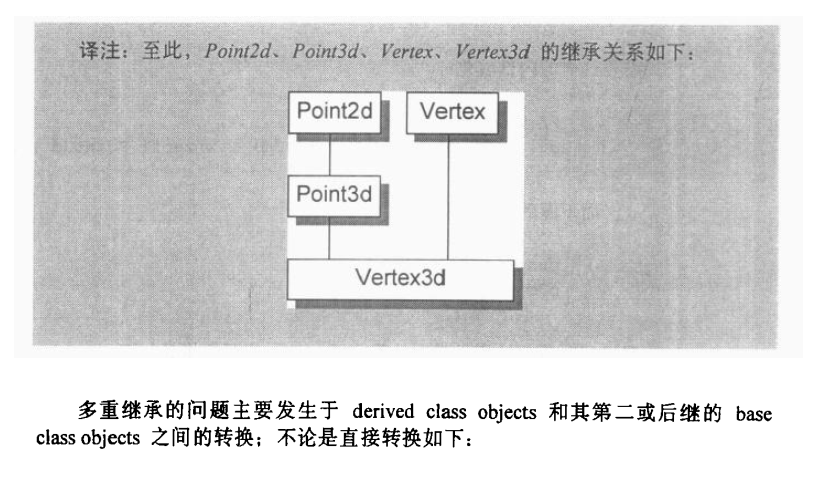

- **一个派生对象，把它的地址指定给最左边的基类，和单一继承一样，因为起始地址是一样的，但是后面的需要更改，因为需要加上前面基类的大小，才能得到后面基类的地址**


```c++
Vertex3d v3d;
Vertex *pv;
Point2d *p2d;
Point3d *p3d;
pv=&v3d;
//可能有如此的内部转换：pv=(Vertex*)(((char*)&v3d)+sizeof(Point3d));
p2=&v3d;
p3d=&v3d;//也许只需最简单的拷贝地址即可
```

### 虚拟继承

要解决的问题：

将istream和ostream各自维护的一个iOS subobject折叠成一个由iostream维护的单一iOS subobject，还可以保留基类和派生类的指针及引用之间的多态绑定操作。

在派生类中安插指针：


或者使用virtual base class table，利用vptr负索引指向相应的虚基类。


## 3.6指向Data Members的指针

取某个坐标成员的地址，代表什么，eg:

vptr通常放在起始处或尾端，与编译器有关，C++标准允许放在类中的任何位置

取某个类成员变量的地址，通常取到得的是在类的首地址的偏移位置

例如 & Point3d::z; 将得到在类的偏移位置，最低限度是类的成员大小总和，而这个偏移量通常都被加上了1

```c++
class Point3d
{
public:
	virtual _Point3d();
protected:
    static Point3d origin;
    float x,y,z;
};
&Point3d::x; //4 or 5 取决于不同编译器，偏移位置不同

//如何区分一个没指向任何数据成员的指针和一个指向第一个数据成员的指eg：
float Point3d::* p1=0;
float Point3d:: *p2=&Point3d::x;
//所以没一个真正的member offset值都被+1，使用前需减去
```

**如果用一个真正绑定类对象（也就是使用 . 操作符访问成员变量）去取地址，得到的将会是内存中真正的地址**

```c++
Point3d orign;
&orign.z; //类型float*
&Pointd::x; //类型 float Point3d::*;
```

在多重继承下，若要将第二个基类的指针和一个与派生类绑定的成员结合起来，那么将会因为需要加入偏移量而变得相当复杂

```c++
struct Base1{int val1;};
struct Base2{int val2;};
struct Derived:Base1,Base2{...}
void func1(int Derived::* dmp,Derived*pd)
{
    pd->*dmp;//将存取到Base1::val1,而非Base2::val2;
}
//pb->*dmp是根据偏移量存取对象中数据
void func2(Derived*pd)
{
    int Base2::*bmp=&Base2::val2;//bmp将是1
    func1(bmp,pd);//但在派生类中val2的偏移是5
}
//涉及到内部转换（偏移量计算），但会需要注意bmp是否为0的问题
```

# 4函数语意

- C++支持三种类型的成员函数：static 、non-static 、virtual
  - static函数限制：
    - **不能直接存取non-static数据**
    - **不能被声明为const**

## 4.1各种调用方式

**非静态成员函数：C++会保证至少和一般的普通的函数有相同的效率，经过三个步骤的转换**

- **改写函数，安插一个额外的参数到该函数中，用来提供一个存取管道------即this指针**

- **对每一个非静态成员的存取操作改成使用this指针来调用**
- **将成员函数改写成一个外部函数，并且名称改为独一无二的**

 任何非静态成员函数在编译器内部都会被转化为 void 返回类型的函数，而且此函数带有编译器创造的两个形参，一个是带有const修饰地址的类的this指针，另一个是原本类型的引用作为返回值（p143）

**虚函数成员函数：也会经过类似的转化**

```c++
//例如： `
ptr->normalize()`会被转化为
( * ptr->vptr[1] )( ptr )
```

- **vptr是编译器产生的指针，指向虚函数表，其名称也会被改为独一无二**
- **1 是该函数在虚函数表中的索引**
- **ptr 则是this指针**

- 静态成员函数：它**没有this指针**，因此会有以下**限制**：
  - **它不能直接存取类中的非成员变量**
  - **它不能够被声明为const、volatile 和 virtual**
  - **它不需要经过类的对象才能被调用----虽然很多事情况是这样调用的**

静态成员函数比起非静态成员函数，少了编译器创造的带有const修饰地址的类的this指针，这意味着你的静态成员函数中将无法调用类域中其他非静态的成员变量以及函数，因为没了this指针。

```c++
//取一个static member function的地址，获取的将是其在内存中的地址由于static member function没有this指针，所以其地址类型不是一个指向class member function的指针，而是指向一个non没明白儿 function的指针 
&Point3d::obj();  //得到unsigned int (*)();而不是unsignd int (Point3d::*)();
```

## 4.2虚成员函数

- 虚函数一般实现模型：**每一个类都有一个虚函数表，内含该类中有作用的虚函数地址，然后每个对象有一个虚函数指针，指向虚表位置**

- **多态含义：以一个基类的指针（或引用），寻址出一个子类对象**

- **什么是积极多态？**

- 当被指出的对象**真正使用**时，多态就变成积极的了

- ### **单一继承虚函数布局图**

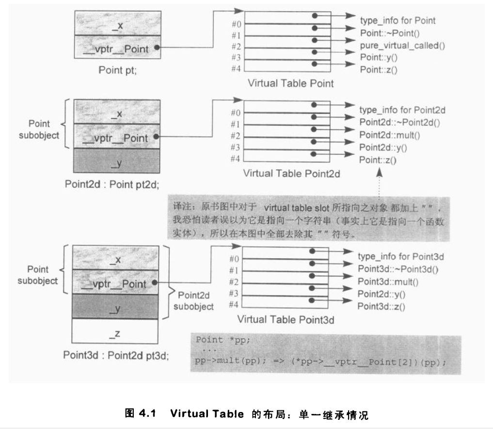

**一个类派生自Point会发生什么事？ 三种可能的情况**

- **它可以继承基类所声明的虚函数的函数实例**，**该函数实例的地址会被拷贝进子类的虚表的相对应的slot之中**

- **它可以使用自己的虚函数实例----它自己的函数实例地址必须放在对应的slot之中**
- **它可以加入一个新的虚函数，这时候虚函数表的尺寸会增加一个slot，而新加入的函数实例地址也会被放进该slot之中**

## 多重继承下的虚函数

复杂度围绕第二个以及后继的base class身上，必须在执行期调整this指针。

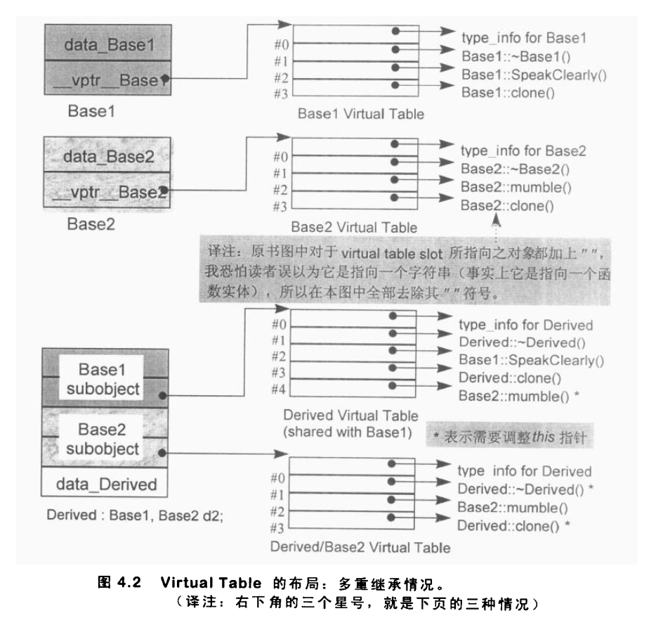

利用第二个或后继的基类指针调用虚函数时，有时会涉及到this指针的调整动作。如上图，利用base1的指针调用派生类虚析构函数不需要调整，而利用base2指针调用则需要调整

三种情况下，第二个或后继的base class会影响虚型函数的支持。

1.通过一个指向第二个base class的指针调用派生类虚函数。

2.通过一个指向派生类的指针调用第二个base class中继承而来的一个虚函数。

3.允许虚函数返回值类型变换，例如返回基类指针，变化返回派生类指针

```c++
Base *ptr=new Derived;
delete ptr;//调用Derived::~Derived, ptr需要后调整sizeof(Base1)个byte;

Derived *pder=new Derived;
pder->mumble();// 调用base2::mumble(); pder前调整sizeof(Base1)个byte

Base2 *pb1=new Derived;
Base2 *pb2=pb1->clone();//进行pb1->clone()时，pb1会被调整指向Derived对象的其实地址，于是clone()的Derived版本会调用，传回指针指向派生类对象，该对象地址在传回个PB1时，先调整以指向Base2 subobject。
```

## 虚拟继承下虚函数

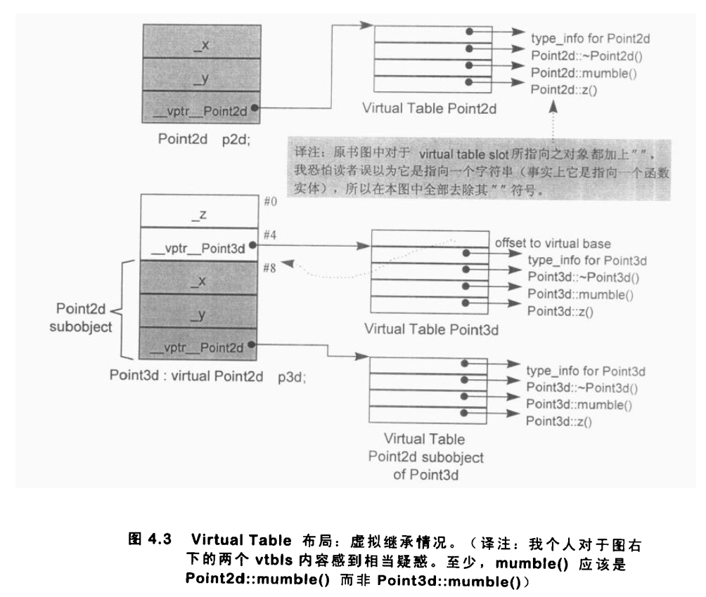

## 4.4指向member function的指针

**对于普通的成员函数，编译器会将其转化为一个函数指针，然后使用成员函数的地址去初始化**。

取一个nonstatic member function的地址，如果函数时nonvirtual，得到的结果时它在内存中真正的地址，需要被绑定于某个class object上才能通过它调用。eg:

```c++
double (Point::* pmf) (); //声明一个指向member function的指针
double (Point::* coord)()=&Point::x; //定义并初始化
coord=&Point::y; //指定其值
(origin.*coord)();
(ptr->*coord)(); //调用
```

**支持指向virtual member function的指针**

首先，利用指向virtual member function的指针调用虚函数可以保持多态性质。

```c++
float (Point::*pmf)()=&Point::z; //z()是一个虚函数
Point *ptr=new Point3d;
ptr->z();
(ptr->*pmf)(); //两个调用的都是Point3d::z();
```

对于虚函数取地址，由于在编译期未知，所以得到的是virtual function 在虚表中的索引。

```c++
class Point
{
public:
    virtual ~Point();
    float x();
    float y();
    virtual float z();
};
&Point::~Point; // 1
&Point::x(); //得函数灶内存地址
```

故，一个指向member function的指针，eg:float (Point::*pmr) ();可以持有两种值，内存地址or续表中的索引。

- **对一个虚函数取地址，在vc编译器下，要么得到vacll thunk地址（虚函数时候），要么得到的是函数地址（普通函数）**

为了使指向成员函数的指针能够支持多重继承和虚拟继承，其可能是类似以下的结构。

```c++
struct __mptr
{
    int index; //为相关virtual table的索引值，或-1（表示不是虚函数）
    int delta;  //可能的this指针调整值
    union
    {
        ptrtofunc faddr;  //持有非虚函数的地址
        int v_offset;    //虚基类（多重继承中第二或后继Base class）的vptr位置。
    };
};
```

## 4.5 inline function（不太懂）

- **inline只是向编译器提出一个请求，是否真的优化取决于编译器自己的判定**
- 对于形式参数，会采用：
  - 常量表达式替换
  - 常量替换
  - 引入临时变量来避免多次求值操作
- 对于局部变量，会采用：
  - 使用临时变量

# 2.构造函数语意学

## 2.1默认构造函数的构造

以下四种情况下，会合成有用的构造函数：

- **带有默认构造函数的成员函数对象，不过这个合成操作只有在构造函数真正需要被调用时才发生，但只是调用其成员的默认构造函数，其他则不会初始化**

- **如果一个派生类的父类带有默认构造函数，那么子类如果没有定义构造函数，则会合成默认构造函数，如果有的话但是没有调用父类的，则编译器会插入一些代码调用父类的默认构造函数**

- 带有一个虚函数的类
  - 类声明（或继承）一个虚函数
  - 类派生自一个继承串链，其中有一个或更多的虚基类
- **带有一个虚基类的类**

- C++新手常见的两个**误解**：
  - **任何class如果没有定义默认构造函数，就会被合成出来一个**
  - **编译器合成出来的默认构造函数会显式设定类中的每一个数据成员的额 默认值**


当编译器需要的时候，会为类合成一个 default constructor，但这个被隐式声明的默认构造函数是不太好的。

如果一个类没有任何 constructor，但它内含一个 member object，而后者有默认构造函数，那编译器会为该类合成一个默认构造函数。

被合成的默认构造函数只满足编译器的需要，而不是程序员的需要。如：类里的指针类型的成员。

**不同编译模块如何避免合成生成了多个默认构造函数？**

解决方法是以 inline 的方式合成，inline 函数具有静态链接，不会被文件以外看到。如果函数太复杂，会合成一个 explicit non-inline static 实例。

**有多个 member objects 要求初始化怎么办？**

按 members 在 class 里的声明顺序进行初始化。

如果写了一个构造函数，而没有把类实例成员变量初始化的话，这个构造函数会被编译器扩充从而把这些类实例成员变量也初始化了。

为什么要扩充我们写的构造函数，而不新建一个构造函数？恰恰就是因为我们写的构造函数存在，新建会让这个函数里的代码实现丢失，扩充省事。

**那带有虚函数的类的默认构造函数会有什么不同吗？**

带有虚函数的类生成的默认构造函数会把虚表地址赋给类指针，但虚函数所需要的 vtable 和与其对应的 vpointer 都是在编译时期生成的，只是对于虚函数的调用生成了通过虚表调用的运行时的指令。

**如果自身的 member 是 class object，同样也没有写默认构造函数呢？**

当需要初始化时，编译器同样会为其合成默认构造函数，并以递归的形式进行初始化。

## 2.2copy construction的构造操作

- 有三种情况会调用拷贝构造函数：
  - **对一个对象做显式的初始化操作**
  - **当对象被当作参数交给某个函数**
  - **当函数传回一个类对象时**

- 如果类没有声明一个拷贝函数，就会有**隐式的声明和隐式的定义**出现，同**默认构造函数**一样在使用时才合成出来

什么情况下一个类不展现“浅拷贝语意”：

- 当类内含有一个成员类而后者的类声明中有一个**拷贝构造函数**（例如内含有string成员变量）

- 当类继承自一个基类而

  基类

  中存在

  拷贝构造函数

  - 这两个编译器都会合成拷贝构造函数并且**安插进那个成员和基类的拷贝构造函数**

- 当类声明了一个或多个虚函数
  - **编译器会显式的设定新类的虚函数表，而不是直接拷贝过来指向同一个**

- 当类派生自一个继承串链，**其中有一个或多个虚基类**
  - **编译器会合成一个拷贝构造函数，安插一些代码用来设定虚基类指针和偏移的初值，对每个成员执行必要的深拷贝初始化操作，以及执行其他的内存相关工作**


同样如果有需要，拷贝构造函数也会被合成。如整数、数组、指针等等的 member 都会被复制。

就连带虚函数的类的 vptr 也会同样复制，同样指向其虚表。

当发生类型切割(子类赋值给基类)时，编译器也足够机智处理好 vptr：

```cpp
derived d;
base b = d; // 类型切割，但 b 的 vptr 指向的是 base 的虚表，不会复制 d 的
derived d2 = d; // 直接复制 d 的 vptr
```

### 2.1.1、bitwise copy

Memberwise copy(深拷贝): 在初始化一个对象期间，基类的构造函数被调用，成员变量被调用，如果它们有构造函数的时候，它们的构造函数被调用，这个过程是一个递归的过程。

Bitwise copy(浅拷贝): 原内存拷贝。例子：给定一个对象 object，它的类型是 class Base。对象 object 占用 10 字节的内存，地址从 0x0 到 0x9。如果还有一个对象 objectTwo ，类型也是 class Base。那么执行 objectTwo = object; 如果使用 Bitwise 拷贝语义,那么将会拷贝从 0x0 到 0x9 的数据到 objectTwo 的内存地址，也就是说 Bitwise 是字节到字节的拷贝。

只有在默认行为所导致的语意不安全或不正确时，我们才需要设计一个 copy assignment operator。默认的 memberwise copy 行为对于我们的 Point object 不安全吗? 不正确吗? 不，由于坐标都内含数值，所以不会发生"别名化（aliasing）"或"内存泄漏（memory leak）"。如果我们自己提供一个 copy assignment operator，程序反倒会执行得比较慢。

如果我们不对 Point 供应一个 copy assignment operator，而光是仰赖默认的 memberwise copy，编译器会产生出一个实例吗? 这个答案和 copy constructor 的情况一样∶实际上不会! 由于此 class 已经有了 bitwise copy 语意，所以 implicit copy assignment operator 被视为毫无用处，也根本不会被合成出来。

一个 cass 对于默认的 copy assignment operator，在以下情况，不会表现出 bitwise copy 语意∶

1. 当 class 内含一个 member object，而其 class 有一个 copy assignment operator 时。
2. 当一个 class 的 base class 有一个 copy assignment operator 时。
3. 当一个 class 声明了任何 virtual functions（我们一定不要拷贝右端 class object 的 vptr 地址，因为它可能是一个 derived class object）时。
4. 当 class 继承自一个 virtual base class（不论此 base class 有没有 copy operator）时。

## 2.3程序转化语意学

- **在将一个类作为另一个类的初值情况下，语言允许编译器有大量的自由发挥的空间，用来提升效率，但是缺点是不能安全的规划拷贝构造函数的副作用，必须视其执行而定**

- 拷贝构造的应用，编译器会多多少的进行部分转换，尤其是**当一个函数以值传递的方式传回一个对象，而该对象有一个合成的构造函数**，此外编译器也会对拷贝构造的调用进行**调优**，以额外的第一参数取代NRV（Named Return Value）

```cpp
X bar()
{
    X xx;
    //……处理 xx 
    return xx;
}
// 编译器对上面的操作进行 NRV 优化之后如下：
void bar( X &__result ){
    // default constructor 被调用
    // C++ 伪码
    __result.X::X();
    //……直接处理 __result 
    return;
}

// 为什么会这样替换？因为一个赋值语句会被拆分，如下：
X a = bar();
// 拆分
X a;
bar(a);
//虽然 NRV 优化提供了重要的效率改善，但它还是饱受批评。
//其中一个原因是，优化由编译器默默完成，而它是否真的被完成，并不十分清楚（因为很少有编译器会说明其实现程度，或是否实现）。
//第二个原因是，一旦函数变得比较复杂，优化也就变得比较难以施行。
//第三个原因是，它改变了程序员所认为会发生的行为，拷贝构造函数被抑制了。
```

## 2.4member initialization list

（[《深度探索C++对象模型》笔记 - 知乎 (zhihu.com)](https://zhuanlan.zhihu.com/p/346417618)）

- 四种情况下你需要使用成员初始化列表
  - **当初始化一个引用成员变量**
  - **当初始化一个const 成员变量**
  - **当调用一个基类的构造函数，而它拥有一组参数**
  - **当调用一个类成员变量的构造函数，而它拥有一组参数**

编译器会一一操作 initialization list，以**适当顺序在 constructor 之内安插初始化操作**，并且在任何explicit user code 之前。

```c++
class Word{
	String _name;
	int _cnt;
public:
	Word(){
		_name = 0;
		_cnt = 0;
	}
/*使用成员列表初始化可以解决    
    	Word() : _name(0)，_cnt(0){
	}
*/	
}
//上式不会报错，但是会有效率问题，因为这样会先产生一个临时的string对象，然后将它初始化，之后以一个赋值运算符将临时对象指定给_name，再摧毁临时的对象
```
值得注意的是：initialization list 的 **member 初始化顺序是由类中 member** 的声明顺序决定的。

```c++
class X
{
    int i,int j;
public:
    X(int val):j(val),i(j){} //出错顺序不对
};

class FooBar:public X
{
    int _fval;
public:
    int fval(){return _fval;}
    FooBar(int val):_fval(val).X(fval())
    {}//此处利用派生类成员函数初始化基类不是个好主意，扩张顺序，是先基类初始化，再初始化_fal;
};
```

# 5.构造，析构，拷贝语意学

- 应注意的一些问题：
  - **构造函数不要写为纯虚函数，因为当抽象类中有数据的时候，将无法初始化**
  - **把所有函数设计成虚函数，再由编译器去除虚函数是错误的，不应该成为虚函数的函数不要设计成虚函数**
  - **当你无法抉择一个函数是否需要为const时，尤其是抽象类，最好不设置成const**

## 5.1无继承下的对象构造

- **对于没有初始化的全局变量，C语言中会将其放在一个未初始化全局区，而C++会将所有全局对象初始化**
- 对于不需要构造函数、析构函数、赋值操作的类或结构体，C++会将其打上**POD**(Plain Old Data)标签，赋值时按照c那样的位搬运
- **对于含有虚函数的类，编译器会在构造函数的开始放入一些初始化虚表和虚指针的操作**，这些代码附加在任何base class construction的调用之后，但必须在任何由使用者供应的代码之前。
- **面对函数以值方式返回，编译器会将其优化为加入一个参数的引用方式，避免多次构造函数**。如果许多函数都需要以by value的形式传值，提供一个copy construction就比较合理。

## 5.2继承体系对象的构造

构造函数会含有大量的隐藏嘛，因为编译器会进行**扩充**：

- 记录在成员**初始化列表中的成员数据**初始化会被放进构造函数的本体，并以成员在类中**声明**的顺序为顺序
- 如果有一个成员并**没有**出现在成员初始化列表中，但是它由一个**默认构造函数**，那么也会被**调用**

- **在那之前，如果类对象由虚表指针，它必须被设定初值，指向适当的虚表**

- **在那之前**，**所有**上一层的**基类构造函数**必须被调用，以**基类声明的顺序**（不是成员初始化列表出现的顺序）

  - **如果基类被列于成员初始化列表中，那么任何显式指定的参数应该传递过去**

  - **如果基类没有被列于基类初始化列表中，而它有默认的构造函数，那么就调用**

  - **如果基类是多重继承下的第二个或后继的基类，那么this指针必须有所调整**

- **在那之前**，所有**虚基类构造函数**必须被调用，**从左到右，从最深到最浅**

  - **如果类被列于成员初始化列表中，那么如果有任何显式指定的参数，都应该传递过去。若没有列于list中，而类中有一个默认构造，亦应该调用**

  - 此外，类中的每一个虚基类的偏移位置必须**在执行期可被存取**

  - **如果类对象是最底层的类，其构造函数可能被调用，某些用以支持这一行为的机制必须被放进来**

- 不要忘记在赋值函数中，**检查自我赋值的情况**

### constructor 的扩充

Constructor 可能内含大量的隐藏码，因为编译器会扩充每一个 constructor，扩充程度视 class T 的继承体系而定。一般而言编译器所做的扩充操作大约如下∶

1. 记录在 member initialization list 中的 data members 初始化操作会被放进 constructor 的函数本体，并以 members 的声明顺序为顺序。
2. 如果有一个 member 并没有出现在 member initialization list 之中，但它有一个 default constructor，那么该 default constructor 必须被调用。
3. 在那之前，如果 class object 有 virtual table pointer（s），它（们）必须被设定初值，指向适当的 virtual table（s）。
4. 在那之前，所有上一层的 base class constructors 必须被调用，以 base class 的声明顺序为顺序（与 member initialization list 中的顺序没关联）
5. 在那之前，所有 virtual base class constructors 必须被调用，从左到右，从最深到最浅

### construction的执行顺序

对于对象而言，"个体发生学"概括了"系统发生学"。constructor 的执行算法通常如下∶

1. 在 derived class constructor 中，"所有 virtual base classes " 及 "上一层 base class " 的 constructors 会被调用。
2. 上述完成之后，对象的 vptr（s）被初始化，指向相关的 virtual table（s）。
3. 如果有 member initialization list 的话，将在 constructor 体内扩展开来。这必须在 vptr 被设定之后才做，以免有一个 virtual member function 被调用。
4. 最后，执行程序员所提供的代码

### 虚拟继承中

在一个虚拟继承体系中，不同的层次的类对象调用虚基类的构造函数额情况不同。eg:

```c++
class Point3d:virtual public Point{};
class Vertex:virtual public Point{};
class Vertex3d:public Point3d,public Vertex{};
class PVertex:public Vertex3d{};
//Vertex的construction必须调用Point的construction，然而，当Point3d和Vertex同时作为Vertex3d的subobject，他们对Point的construction的调用操作一定不可以发生，取而代之，作为最底层的class，Vector3d需要将Point初始化。eg
Point3d origin;//Point3d可以正确的调用其Pointd virtual base class subobject
Vector3d cv; //Vector3d可以正确的调用其Pointd virtual base class subobject，其基类Point3d和vertex不会
```

### vptr 必须被设立的情况(5.2看，以及218，219)

下面是 vptr 必须被设定的两种情况∶

1. 当一个完整的对象被构造起来时。如果我们声明一个 Point 对象，则 Point constructor 必须设定其 vptr。
2. 当一个 subobject constructor 调用了一个 virtual function（不论是直接调用或间接调用）时。

## 5.3对象复制语意学

- 当一个类复制给另一个类时，能采用的有三种方式：
  - 什么都不做，会实施默认行为
    - 如果有需要，会自动生成一个**浅拷贝**，至于什么时候需要**深拷贝**（见第二章讲）
  - **提供一个拷贝复制运算符**
  - **显式地拒绝把一个类拷贝给另一个**

- **虚基类会使其复制操作调用一次以上，因此我们应该避免在徐杰类中声明数据成员**

一种subobject多次拷贝但是正确的例子：

```c++
inline Vertx3d& Vertex3d::operator=(const Vertex3d& rhs)
{
    this->Point3d::operator=(rhs);
    this->Vertex3d::operator=(rhs);
    this->Point::operator=(rhs);  //显示的调用基类的拷贝赋值，注意顺序就会正确
}
```

## 5.5析构函数语意学

- 什么时候会**合成析构函数**？
  - **在类内含的成员函数有析构函数**
  - **基类含有析构函数**

析构的**正确顺序**：

- **析构函数的本体首先被执行，vptr会在程序员的代码执行前被重设。**
- **如果类拥有成员类对象，而后者拥有析构函数，那么他们会以其声明顺序的相反顺序被调用**
- **如果类内涵一个vptr,现在被重新设定，指向适当的积累的虚表**

- **如果有任何直接的非虚基类拥有析构函数，它们会以其声明顺序的相反顺序被调用**
- **如果有任何虚基类拥有析构函数，而且目前讨论的这个类是最尾端的类，那么它们会以其原来的构造顺序的相反顺序被调用**

# 6.执行期语意学

- **C++难以从程序源码看出表达式的复杂过程，因为你并不知道编译器会在其中添加多少代码**

编译器对**不同**的对象会做**不同**的操作：

## global object

- 对于**全局对象**：编译器会在添加__main函数和_exit函数(和C库中的不同)，并且在这两个函数中对所有全局对象进行静态初始化和析构

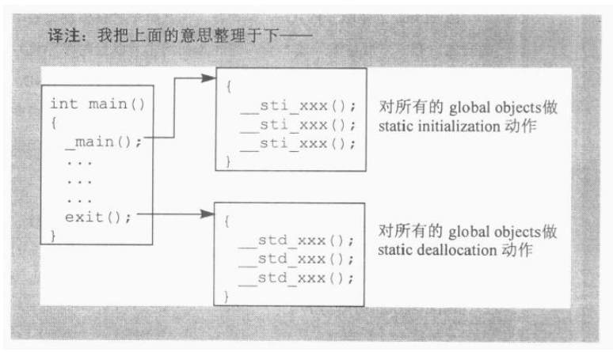

- 使用被静态初始化的对象，有一些**缺点**：
  - 如果异常处理被支持，那么那些对象将不能被放置到try区段之内
  - 增加了程序的复杂度
- 因此，不建议用那些需要静态初始化的全局对象

## local static object

- 对于**局部静态对象**：
  - 会增加临时的对象用来判断其是否被构造，用来保证在**第一次进入含有该静态对象的起始处**调用一次构造函数，并且**在离开文件的时候利用临时对象判断是否已经被构造来决定是否析构**

## Array of objects

例如`Point knots[10]`

- 如果对象没有定义构造函数和析构函数，那么编译器只需要分配需要存储10个连续空间即可
- 如果有构造函数，且如果有名字，则会分为是否含有虚基类调用不同的函数来构造，如果没有名字，例如没有knots，则会使用new来分配在堆中

- 当声明结束时会有类似构造的析构过程
- **我们无法在程序中取出一个构造函数的地址**

## new与delete

- 对于**普通类型变量**：

- 例如 `int *pi = new int(5)`

  - 调用函数库中的new运算符`if(int *pi = _new (sizeof(int) ))`
  - 再配置初值 `*pi = 5`

- 对于delete来说 `delete pi;`

  - 则先进行保护 `if( pi != 0)`

  - 再调用delete `_delete(pi)`

对于**成员对象**：

- 对于`Point3d* origin = new Point3d`
- 实际调用operator new，其代码如下

```c++
extern void* operator new (size_t size){
    if(size == 0)
        size = 1;
    void * last_alloc;
    while(!(last_alloc = malloc(size))){
        if(_new_handler)
            ( *_new_handler)();
        else
            return 0;
    }
    return last_alloc;
}
```

- 语言要求每一次对new的调用都必须传回一个独一无二的指针，为了解决这个问题，传回一个指向默认为1Byte的内存区块，允许程序员自己定义_new_handler函数，并且循环调用
- 至于delete也相同

```c++
extern void operator delete (void *ptr){
	if(ptr)
		free( (char*)ptr)
}
```

- 对于对象数组，会在分配的内存上方放上cookies，来存储数组个数，方便delete调用来析构
- **程序员最好避免以一个基类指向一个子类所组成的数组—如果子类对象比其基类大的话**
- 解决方式：

```c++
for(int ix = 0; ix < elem_count; ++ix){
	Point3d *p = &((Point3d*)ptr)[ix];
	delete p;
}
```

- **程序员必须迭代走过整个数组，把delete运算符实施与每一个元素身上。以此方式，调用操作将是virtual。因此，Point3d和Point的析构函数都会实施与每一个对象上**

Placement Operator new的语意

- **有一个预先定义好的重载的new运算符，称为placement operator new。它需要第二个参数，类型为void***

- 形如 `Point2w *ptw = new (arena) Point2w`,**其中arena指向内存中的一个区块，用以放置新产生出来的Point2w 对象**

```c++
void* operator new(size_t , void* p){
	return p;
}
```

- **如果我们在已有对象的基础上调用placement new的话，原来的析构函数并不会被调用，而是直接删除原来的指针，但是不能使用delete 原来的指针**
- 正确的方法应该是 :

```c++
//错误：
delete p2w;
p2w = new(arwna) Point2w;
//正确：
p2w->Point2w;
p2w = new(arena) Point2w;
```

## 临时性对象

- 临时对象在类的表达式并赋值，函数以值方式传参等都会**产生临时对象**-----而临时对象会构造和析构，所以会拖慢程序的效率，我们应该尽量避免

如果我们有一个函数，形式如下∶

```cpp
T operator+(const T&, const T&);
```

以及两个 T objects，a 和 b，那么∶

```cpp
a + b;
```

可能会导致一个临时性对象，以放置传回的对象。是否会导致一个临时性对象，视编译器的进取性（aggressiveness）以及上述操作发生时的程序语境（program context）而定。例如下面这个片段∶

```cpp
T a, b; 
T c = a + b;
```

编译器会产生一个临时性对象，放置 a+b 的结果，然后再使用 T 的 copy constuctor，把该临时性对象当做 c 的初始值。然而比较更可能的转换是直接以拷贝构造的方式，将 a+b 的值放到 c 中，于是就不需要临时性对象，以及对其 constructor 和 destructor 的调用了。

理论上，C++ Standard 允许编译器厂商有完全的自由度。但实际上，由于市场的竞争，几乎保证任何表达式（expression）如果有这种形式∶

```cpp
T c = a + b;
```

而其中的加法运算符被定义为∶

```cpp
T operator+(const T&, const T&);
```

或

```cpp
T T::operator+(const T&);
```

那么实现时根本不产生一个临时性对象。

```cpp
bool verbose;
String progNameVersion =
    !verbose ? 0 : progName + progVersion;
```

其中 progName 和 progVersion 都是 String objects。这时候会生出一个临时对象，放置加法运算符的运算结果∶

```cpp
String operator+(const String&, const String&);
```

临时对象必须根据对 verbose 的测试结果，有条件地析构。在临时对象的生命规则之下，它应该在完整的 "?∶表达式" 结束评估之后尽快被摧毁。然而，如果 progNameVersion 的初始化需要调用一个 copy constructor∶

```cpp
// C++ 伪码
progNameversion.String::String(temp);
```

那么临时性对象的析构（在 "?∶完整表达式" 之后）当然就不是我们所期望的。

C++ Standard 要求说∶

……凡持有表达式执行结果的临时性对象，应该存留到object的初始化操作完成为止。

但还是要避免赋给一个指针的操作。

# 7.站在对象模型的顶端

- 三个著名的C++语言扩充性质：**模板、异常（EH）、RTTI（runtime type identification）**

## 7.1template

- **模板实例化时间线**：

  - **当编译器看到模板类的声明时，什么都不会做，不会进行实例化**

  - **模板类中明确类型的参数，通过模板类的某个实例化版本才能存取操作**

  - **即使是静态类型的变量，也需要与具体的实例版本关联，不同版本有不同的一份**

  - **如果声明一个模板类的指针，那么不会进行实例化，但是如果是引用，那么会进行实例化**

  - **对于模板类中的成员函数，只有在函数使用的时候才会进行实例化**

- 模板名称决议的方法-----**即如果非成员函数在类中调用，那么会调用名称相同的哪个版本：**
  - **会根据该函数是否与模板有关来判断，如果是已知类型，那么会在定义的范围内直接查找，如果以来模板的具体类型，那么会在实例化的范围查找**

## 7.2 异常处理

- C++**异常处理**由**三个**主要的语汇组件：

  - **一个throw子语。它在程序某处发出一个exception，exception可以说内建类型也可以是自定义类型**

  - **一个或多个catch子句。每一个catch子句都是一个exceotion hander，它用来表示说，这个子句准备处理某种类型exception，并且在封闭的大括号区段中提供实际的处理程序**

  - **一个try区段。它被围绕一系列的叙述句，这些叙述句可能会引发catch子句起作用**

- **当一个异常被抛出去，控制权会从函数调用中被释放出来，并寻找一个吻合的catch子句。如果都没有吻合者，那么默认的处理例程 terminate()会被调用，当控制权被放弃后，堆栈中的每一个函数调用也就被推离。这个程序被称为 unwingding the stack 。在每一个函数被推离堆栈之前，函数的局部类的析构会被调用**

- **因此一个解决办法就是将类封装在一个类中，这样变成局部类，如果抛出异常也会被自动析构**

- 当一个异常抛出，**编译系统必须**：

  1. **检查发生throw操作的函数**
  2. **决定throw操作是否发生在try区段**
  3. **若是，编译系统必须把异常类型拿来和每一个catch子句进行比较**
  4. **如果比较后吻合，流程控制应该交到catch子句中**
  5. 如果throw的发生并不在try区段中，或没有一个catch子句吻合，那么系统必须：
     - **摧毁所有活跃局部类**
     - **从堆栈中将目前的函数(unwind)释放掉**
     - **进行到程序堆栈的下一个函数中去，然后重复上述步骤2—5**

## 7.3RTTI

- 当两个类有继承关系的时候，我们有转换需求时，可以进行向下转型，但是很多时候是**不安全的**
- **C++的RTTI (执行期类型识别)提供了一个安全的向下转型设备，但是只对多态（继承和动态绑定）的类型有效，其用来支持RTTI的策略就是，在C++的虚函数表的第一个slot处，放一个指针，指向保存该类的一些信息----即type_info类（在编译器文件中可以找到其定义）**
- **dynamic_cast运算符可以在执行期决定真正的类型**
  - 对于指针来说：
    - **如果转型成功，则会返回一个转换后的指针**
    - **如果是不安全的，会传回0**
    - **放在程序中通过 if 来判断是否成功，采取不同措施**
  - 对于引用来说：
    - **如果引用真正转换到适当的子类，则可以继续**
    - **如果不能转换的化，会抛出 bad_cast 异常**
    - **通常使用 try 和 catch 来进行判断是否成功**
- **Typeid运算符**：
  - **可以传入一个引用,typeid运算符会传回一个const reference,类型为type_info。其内部已经重载了 == 运算符，可以直接判断两个是否相等，回传一个bool值**
  - 例如 `if( typeid( rt ) == typeid( fct ) )`
  - **RTTI虽然只适用于多态类，但是事实上type_info object也适用于内建类，以及非多态的使用者自定类型，只不过内建类型 得到的type_info类是静态取得，而不是执行期取得
