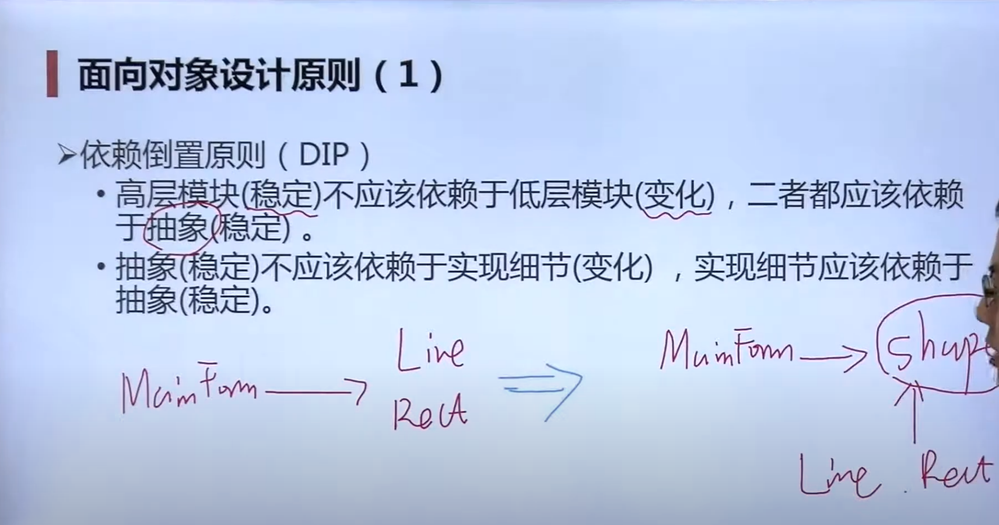
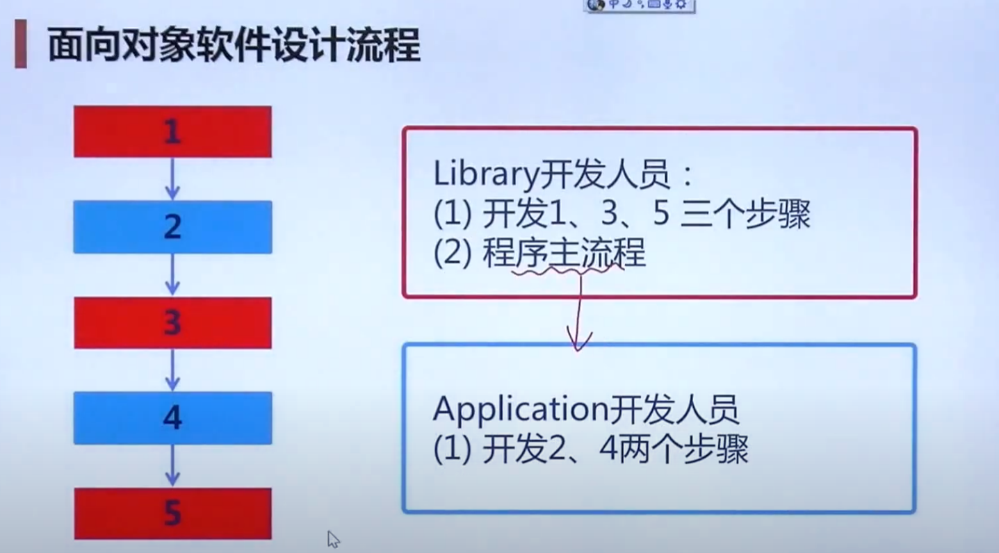
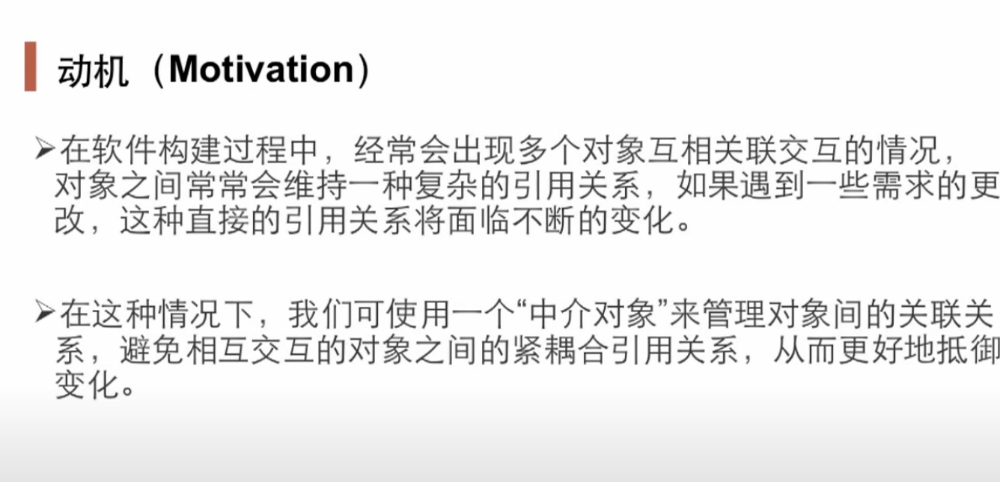
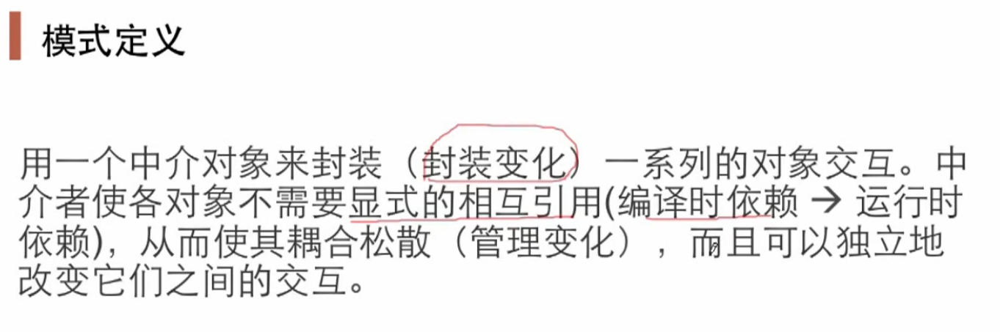
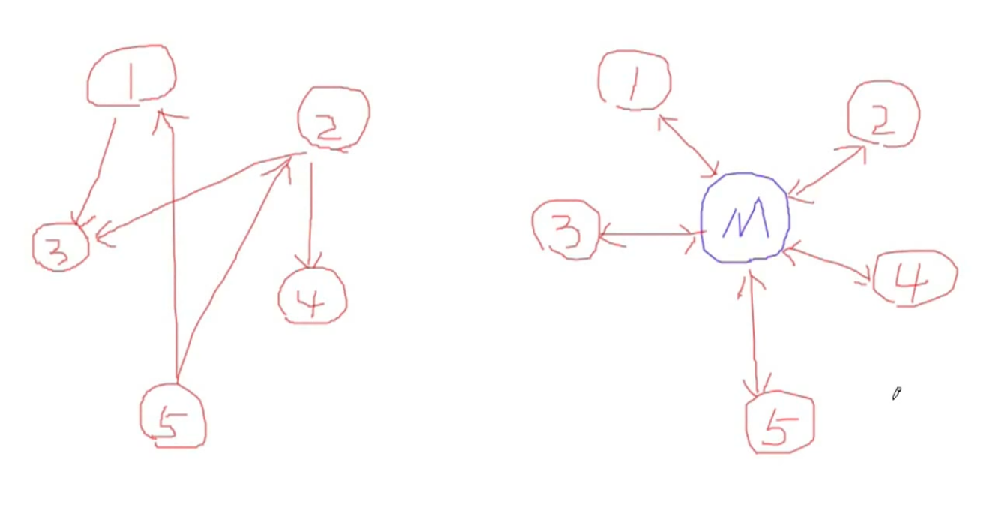
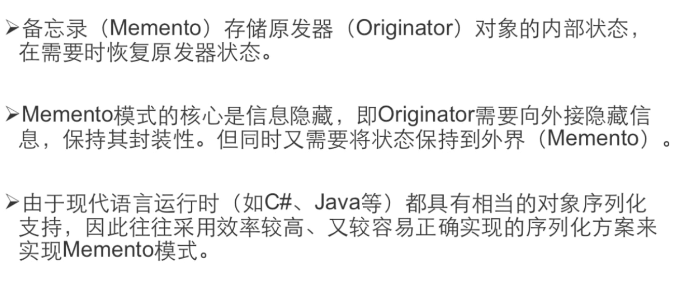
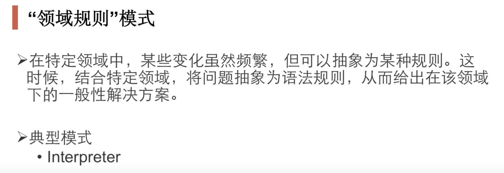

# 资料

视频：[设计模式-李建忠](https://www.youtube.com/watch?v=6f7ykipOmfE&list=PLE0JTxLz7jTR2e8nAyV9vPIqH5NNxlI3N)
参考项目：[ design-patterns-cpp](https://github.com/JakubVojvoda/design-patterns-cpp)

# 面向对象设计原则

隔离变化，减小变化带来的影响；

各自负责各自的责任；

接口一致，实现不一致；

## 设计原则

1. 依赖倒置原则（DIP）,

2.开放封闭原则（OCP）

对扩展开放，对更改封闭；

类模块应该可扩展，但不可修改

3.单一职责原则（SRP）

一个类应该仅有一个引起它变化的原因；

变化的方向隐含着类的责任

4.（LSP）替换原则

子类必须能够替换基类  is-a

5.接口应该小而完备 ，接口隔离原则

6.优先使用对象组合，而不是类继承

7.封装变化点，可以在分界层一侧修改，另一侧稳定

8.针对接口编程

# 重构

重构获得模式

重要点：应对变化，提高复用；

寻找变化点，在变化点出应用设计模式；什么时候、什么地点用设计模式很重要；

关键技法： 

# 分类

有多种分类方法eg:我们可以按目的将其分为创造型（抽象的实例化过程）、结构型（类和对象如何组成更大的结构）和行为模式（对象间的责任分配）。

在此：

## 组件协作

**框架和应用程序的划分，组件协作模式通过晚绑定实现框架与程序松耦合**

### Template Method  模板方法

模板方法在操作中定义算法的框架，将一些步骤推迟到子类中。它允许子类在不改变算法结构的情况下重新定义算法的某些步骤。模式具有行为目的，并应用于类。

何时使用

一次实现算法的不变部分，然后让子类实现可能变化的行为，当子类之间的共同行为应该在一个公共类中考虑和本地化时，以避免代码重复来控制子类扩展

**注意寻找逻辑的稳定部分以及容易变化的部分**

稳定的整体结构，子步骤多变的需求。

### Strategy  策略

策略定义了一个算法系列，封装了每个算法，并使它们可以互换（变化）。它让算法独立于使用它的客户而变化（稳定）。该模式具有行为目的，适用于对象。

使用时机
许多相关的类只在行为上有所不同
你需要一个算法的不同变体
一个算法使用了客户不应该知道的数据

### Observer/Event  观察者，从属对象如何保持最新的状态  (没有搞清楚用途以及必要性在哪方面)

为某些对象建立一种通知依赖关系，一个对象（目标对象）的状态发生改变，所有的依赖对象（观察者对象）都将会得到通知。

观察者
Observer在对象之间定义了一对多的依赖关系，这样当一个对象改变状态时，它的所有依赖都会被通知并自动更新。模式具有行为目的并应用于对象。

何时使用
当一个抽象有两个方面时，其中一个依赖于另一个
当对一个对象的更改需要更改其他对象时，您不知道需要更改多少对象
一个对象应该能够通知其他对象，而不需要假设这些对象是谁

## 单一职责

### Decorator  装饰模式

动态(组合)地将额外的责任附加到一个对象上。装饰器为扩展功能提供了一个灵活的替代子类的方法。该模式具有结构性目的，适用于对象。

何时使用
以动态和透明的方式向单个对象添加责任，也就是说，不影响其他对象。
对于可以撤销的责任
当通过子类的扩展是不实际的时候

**注意哪些既继承了基类，还有一个指向基类指针的情况**

### Bridge  桥模式

将一个抽象（业务功能）概念与它的实现（实现）解耦(**多个不同的变化维度**)，使两者可以独立变化。桥接模式具有结构性目的，适用于对象，所以它处理对象的组成。

什么时候使用
你想避免抽象和它的实现之间的永久绑定。
抽象和它们的实现都应该可以通过子类化来扩展
抽象的实现的改变不应该对客户产生影响
你想对客户完全隐藏抽象的实现

## 对象创建

### 工厂模式

**定义一个创建对象的接口，但让子类决定实例化哪个类。工厂方法让一个类将实例化工作推迟到子类。**这种模式有创造的目的，适用于通过继承来处理关系的类，即它们在编译时是静态固定的。与抽象工厂不同的是，工厂方法只包含生产一种类型产品的方法。

何时使用
一个类无法预料到它必须创建的对象的类别
一个类希望它的子类能指定它所创建的对象
类将责任委托给几个辅助子类中的一个，而你想将哪个辅助子类是委托者的知识本地化。

### 抽象工厂

抽象工厂模式有创建的目的，并提供了一个接口，用于创建相关或依赖对象的系列，而不需要指定它们的具体类。模式适用于对象，处理对象的关系，这是更动态的。与工厂方法相反，抽象工厂模式产生的类型家族是相关的，也就是说，它产生的类型有一个以上的方法。

何时使用
一个系统应该独立于其产品的创建、组成和表示方式。
一个系统应该被配置成多个产品系列中的一个。
一组相关的产品对象被设计为可以一起使用
你想提供一个产品的类库，你只想揭示它们的接口，而不是它们的实现。

### 原型模式

指定使用原型实例创建的对象的种类，并通过复制这个原型创建新的对象。模式有创建的目的，并处理对象的关系，这是更动态的。该模式向客户隐藏了制作新实例的复杂性。

何时使用
当要实例化的类在运行时被指定时
避免建立一个与产品的类层次结构相似的工厂类层次结构
当一个类的实例只能有几种不同的状态组合中的一种时

### 构建器模式

构建器
构建者模式有创造的目的，并**将复杂对象的构建与它的表示分离开来，因此同一个构建过程可以创造不同的表示**。它是对象模式，即关系可以在运行时改变，并且更加动态。通常用于构建复合结构，但与使用工厂相比，构建对象需要客户有更多的领域知识。

什么时候使用
创建一个对象的算法应该独立于各个部分以及它们的组装方式。
构建过程必须允许对所构建的对象进行不同的表述

## 对象性能

### Singleton  单件模式

### Flyweight  享元模式

Flyweight模式有结构性的目的，**适用于对象，并使用共享来有效支持大量的细粒度对象**。当你需要创建大量的类似对象时，该模式可以用来减少内存的使用。

## 接口隔离

### Façade  门面模式

为子系统中的一组接口提供一个统一(稳定)的接口。Facade定义了一个更高层次的接口，使子系统更容易使用（复用）。该模式具有结构性目的，适用于对象。

**稳定的接口隔离变化体**

### 代理模式

**为其他对象提供一种代理以控制（隔离，使用接口）对这个对象的访问**

### 适配器模式

**将一个接口转换成客户希望的另一个接口**。允许使用一个具有不兼容接口的客户端的适配器来完成转换。类适配器使用多重继承来使一个接口适应另一个接口，而对象适配器使用对象组合来结合具有不同接口的类。

**你想使用一个现有的类，而它的接口与你需要的接口不一致**
**你想创建一个可重用的类，与那些不一定有兼容接口的类合作。**

### 中介模式

## 状态变化

### State 状态变化模式

### 备忘录模式

## 数据结构

### Composite  组合模式

### iterator   迭代器

### 职责链模式

多于一个对象可以处理一个请求，并且处理者应该被自动确定。
你想向几个对象中的一个发出请求，而不明确指定接收者
可以处理一个请求的对象的集合应该被动态地指定。

## 行为变化

### command   命令模式

什么时候使用
想通过执行的操作来给对象设置参数
想在不同时间指定、排队和执行请求
支持撤销
支持记录变化，以便在系统崩溃时可以重新应用这些变化
围绕建立在基元操作上的高级操作构建系统

### 访问器 Visitor

Visitor模式预料未来会在类层次结构中添加新的行为，预先设计了将来的新的行为

## 领域问题

### 解析器  Interpreter

